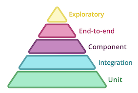

# bookstore
Spring boot based bookstore application. The primary objective to develope bookstore is to learn practical test implementation in a spring app based on the test pyramid concepts.

## About the App
Bookstore is a Rest Application which exposes few endpoints as below:
- /books : Get all the books from repository.
- /book/{isbn} : Get a book by given isbn path parameter.
- /book/price/{isbn} : Get a book price by given isbn path parameter.

The bookstore also listens on a Kafka topic (books) and stores the consumed event in bookRepository (in memory h2 database). It expects the event as `{isbn}:{bookTitle} -> 123:Clean Code`. The same book can be fetched by bookstore APIs.

In addition to above, bookstore talks to an external service to fetch the book price. The fetched price for an isbn used to form `book/price/{isbn}` response. In case of price service failures, the book stores returns failure messages.

# Test Pyramid

The principle behind test automation is to get **_fast and accurate_** feedback for any product changes. One way to do that is **_write lots of small and fast unit tests_**. 
Write some more coarse-grained tests and **_very few high-level_** tests that test your application from end to end.



Some useful resources on test pyramid:
- https://martinfowler.com/bliki/TestPyramid.html
- https://testpyramid.com/

## Unit Test
Smallest piece of code tested in isolation.

### What to test in Unit Layer
- One test class per production class.
- A unit test class should at least test public interface of the class.
- Make sure all the happy paths and edge cases are tested. 
- Unit tests should not be tied to implementation too closely. Unit test should test for 
If I enter value x and y, will the result be z? Not if I enter value x, will the method A gets called and then return some result of class A plus the result of class B?
- Private methods are considered as implementation details. No need to test them.

### Test Structure
  Arrange -> Act -> Assert
  
  Given -> When -> Then
  
  Setup test data -> Test -> Assert
  
### Sample Test
Controller Test
```java
    @Test
    void shouldReturnAllBooks() throws Exception {
        Book book = new Book("121212", "A Book");
        ArrayList<Book> books = new ArrayList<>();
        books.add(book);

        given(bookRepository.findAll()).willReturn(books);

        mockMvc.perform(get("/books"))
                .andDo(print())
                .andExpect(content().json("[{\"id\":" + null + ", \"isbn\":\"121212\",\"title\":\"A Book\"}]"))
                .andExpect(status().is2xxSuccessful());
    }
```
  
### Value added by Unit Tests
- Prevention of bugs 
- Supports refactoring
- Leads to better design 
- Prevents breaking changes
- More confidence on your code

### Useful resources on Unit Testing
- https://chapmanworld.com/2019/10/06/the-true-value-of-unit-testing/

## Integration Test
Integration tests are added to codebase with an objective that modules developed separately work as expected when integrated.

### What to test in Integration Layer
- When testing a submodule with other module, the integration test should verify that the submodule is able
to communicate sufficiently with other module. It should have basic coverage of success and error scenarios.
- The integration tests should not be testing the state of communication, example if module A gives input X then output of module B should be Y. 
Additional coverage can be tested in other layers of pyramid. 
- There should  be very few integration tests which give faster feedback.
- Test Beds (mocks, stubs) can be used to test the integration points.

### Sample Test
```java
@Test
    public void shouldCallWeatherService() throws Exception {
        wireMockServer.stubFor(get(urlEqualTo("/price"))
                .willReturn(aResponse()
                        .withBody(read("classpath:price_response.json"))
                        .withHeader(CONTENT_TYPE, MediaType.APPLICATION_JSON_VALUE)
                        .withStatus(200)));
        var weatherResponse = subject.fetchPrice();
        assertThat(weatherResponse.getPrice(), is(10.00));
    }
```

In above test, `subject.fetchPrice()` reads the priceService  url from configuration file. Having above
test insures that our service is able to read the configuration properly and talks to the external service.

_There is a downside of using wireMock stub, as it returns a prefixed response and does not know anything if actual price
service changes the response schema. To ensure if there is any schema change/contract break from external service, we can have
contract tests._ 

### Value added by Integration Tests
- Tests the communication between different sub-modules
- Faster feedback