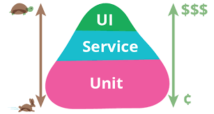

# bookstore
Spring boot based bookstore application. The primary objective to develope bookstore is to learn practical test implementation in a spring app based on the test pyramid concepts.

## About the App
Bookstore is a Rest Application which exposes few endpoints as below:
- /books : Get all the books from repository.
- /book/{isbn} : Get a book by given isbn path parameter.
- /book/price/{isbn} : Get a book price by given isbn path parameter.

**Kafka Use Case**
* Consumer Side - The bookstore listens on a Kafka topic  (`newbooks`) and adds the consumed event in bookRepository.
* Producer Side - The bookstore listens on a Kafka topic (`removeentry`) and deletes the book from bookRepository. It also produces an event for consumers of bookstore to update them about deletion a book from database.
The producer produces event on `consumer-one` topic.

**Integration With Other Service**

In order to replicate the microservice usecase, the bookstore talks to price service to fetch the price of a book. Its REST API based communication.

### How to run tests
`gradle test` runs all the unit tests. 

`gradle integrationTest` runs integration tests.

`gradle componentTest` runs integration tests.

# Test Pyramid

The principle behind test automation is to get **_fast and accurate_** feedback for any changes in the code. Test pyramid talks about **_writing lots of small and fast unit tests_**. 
Write some more coarse-grained tests and **_very few high-level_** tests that test your application from end to end.


Some useful resources on test pyramid:
- https://martinfowler.com/bliki/TestPyramid.html
- https://testpyramid.com/

## Unit Test
Smallest piece of code tested in isolation.

### What to test in Unit Layer
- One test class per production class.
- A unit test class should at least test public interface of the class.
- Make sure all the happy paths and edge cases are tested. 
- Unit tests should not be tied to implementation too closely. Unit test should test for 
If I enter value x and y, will the result be z? Not if I enter value x, will the method A gets called and then return some result of class A plus the result of class B?
- Private methods are considered as implementation details. No need to test them.

### Test Structure
  Arrange -> Act -> Assert
  
  Given -> When -> Then
  
  Setup test data -> Test -> Assert
  
### Sample Test
Controller Test
```java
    @Test
    void shouldReturnAllBooks() throws Exception {
        Book book = new Book("121212", "A Book");
        ArrayList<Book> books = new ArrayList<>();
        books.add(book);

        given(bookRepository.findAll()).willReturn(books);

        mockMvc.perform(get("/books"))
                .andDo(print())
                .andExpect(content().json("[{\"id\":" + null + ", \"isbn\":\"121212\",\"title\":\"A Book\"}]"))
                .andExpect(status().is2xxSuccessful());
    }
```
  
### Value added by Unit Tests
- Prevention of bugs 
- Supports refactoring
- Leads to better design 
- Prevents breaking changes
- More confidence on your code

### Useful resources on Unit Testing
- https://chapmanworld.com/2019/10/06/the-true-value-of-unit-testing/

## Integration Test
Integration tests are added to codebase with an objective that modules developed separately work as expected when integrated.

### What to test in Integration Layer
- When testing a submodule with other module, the integration test should verify that the submodule is able
to communicate sufficiently with other module. It should have basic coverage of success and error scenarios.
- The integration tests should not be testing the state of communication, example if module A gives input X then output of module B should be Y. 
Additional coverage can be tested in other layers of pyramid. 
- There should  be very few integration tests which give faster feedback.
- Test Beds (mocks, stubs) can be used to test the integration points.

### Sample Test
```java
    @Test
    public void shouldCallWeatherService() throws Exception {
        wireMockServer.stubFor(get(urlEqualTo("/price"))
                .willReturn(aResponse()
                        .withBody(read("classpath:price_response.json"))
                        .withHeader(CONTENT_TYPE, MediaType.APPLICATION_JSON_VALUE)
                        .withStatus(200)));
        var weatherResponse = subject.fetchPrice();
        assertThat(weatherResponse.getPrice(), is(10.00));
    }
```

In above test, `subject.fetchPrice()` reads the priceService  url from configuration file. Having above
test insures that our service is able to read the configuration properly and talks to the external service.

_There is a downside of using wireMock stub, as it returns a prefixed response and does not know anything if actual price
service changes the response schema. To ensure contract change by external service does not break our system
in production, we can have contract tests._ One can refer to https://martinfowler.com/bliki/ContractTest.html to read more about
contract testing.

### Value added by Integration Tests
- Tests the communication between different sub-modules
- Faster feedback

### Useful resources on Integration Test
- https://martinfowler.com/bliki/IntegrationTest.html

## Component Test
Testing the whole component isolating the third-party code and services.

Goal of component testing is to test that different parts of the microservice work together as expected at the same time isolating third-party code and services. 
The isolation of dependencies can be achieved by test beds (mocks, in-memory database etc).

### What to Test:
- end to end journey of micro-service
- unhappy paths
- testbeds are producing a slow response, offline, malformed response or broke the contract.

### Important Points
- The component testing can achieved by running the microservice in memory along with in memory test doubles. 
This will make the tests faster but will not touch the network. This also needs a separate application config to run the microservice in memory.

### Sample Test
```java
    @Test
    public void shouldReturnBookResponseWithPrice() throws Exception {
        wireMockServer.stubFor(get(urlEqualTo("/price"))
                .willReturn(aResponse()
                        .withBody(read("classpath:price_response.json"))
                        .withHeader(CONTENT_TYPE, MediaType.APPLICATION_JSON_VALUE)
                        .withStatus(200)));

        when()
                .get(String.format("http://localhost:%s/book/price/123", port))
                .then()
                .log().all()
                .statusCode(is(200))
                .body(containsString("{\"id\":1,\"isbn\":\"123\",\"title\":\"Clean Code\",\"price\":10.0}"));
    }
```

**[Test with Kafka Integration](https://github.com/priyanshus/bookstore/blob/master/src/test/java/com/bookstore/component/BookStoreKafkaTest.java)**

```java
    @Test
    void shouldAddBookWhenEventReceivedForNewEntry() throws ExecutionException, InterruptedException, IOException {
        produceEvent("books", "156:Java Book");
        produceEvent("books", "157:Clean Code");
        await()
                .atMost(60, TimeUnit.SECONDS)
                .untilAsserted(
                        () -> {
                            Assertions.assertEquals(bookRepository.count(), 3);
                        });

        when()
                .get(String.format("http://localhost:%s/book/price/156", port))
                .then()
                .log().all()
                .statusCode(is(200))
                .body(containsString("\"isbn\":\"156\",\"title\":\"Java Book\",\"price\":10.0}"));
    }
    
    @Test
    void shouldDeleteBookWhenEventReceivedToDeleteBook() throws ExecutionException, InterruptedException {
        produceEvent("remove.entry", "123");

        List<String> eventsReceived = consumeEvents("consumer-one");
        Assertions.assertEquals(1, eventsReceived.size(), "Events Received Count");
        Assertions.assertEquals("123", eventsReceived.get(0), "Event Content");
    }
```
Read more about Component Testing [here](https://dzone.com/articles/component-testing-for-event-driven-microservice "here").

### Useful Resources on Microservice testing strategy
- https://martinfowler.com/articles/microservice-testing/
- https://martinfowler.com/articles/practical-test-pyramid.html
